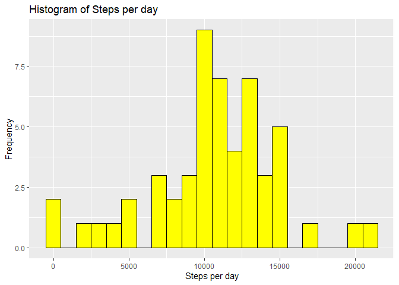
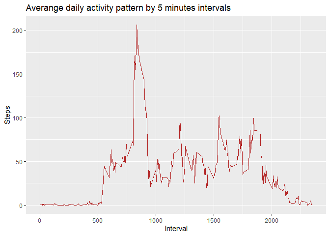
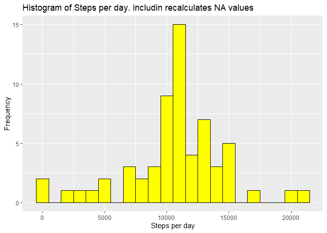
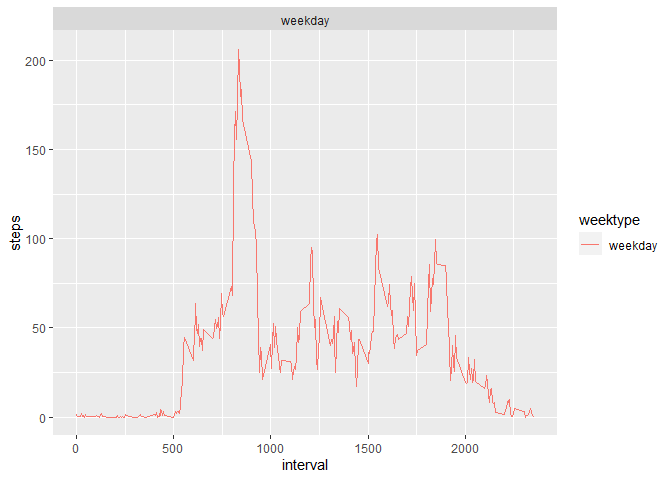

Reproducible Research: Peer Assessment 1

------------------------------------------------------------------------

Set up environment
------------------

    library(tidyr)

    ## Warning: package 'tidyr' was built under R version 4.0.3

    library(dplyr)

    ## 
    ## Attaching package: 'dplyr'

    ## The following objects are masked from 'package:stats':
    ## 
    ##     filter, lag

    ## The following objects are masked from 'package:base':
    ## 
    ##     intersect, setdiff, setequal, union

    library(ggplot2)

    ## Warning: package 'ggplot2' was built under R version 4.0.3

Loading and preprocessing the data
----------------------------------

    unzip("./activity.zip")
    steps <- read.csv("./activity.csv",header = TRUE, sep = ',', 
                      colClasses = c("numeric", "character", "integer"))

    library(lubridate)

    ## Warning: package 'lubridate' was built under R version 4.0.3

    ## 
    ## Attaching package: 'lubridate'

    ## The following objects are masked from 'package:base':
    ## 
    ##     date, intersect, setdiff, union

    steps$date <- as.Date(strptime(steps$date, format="%Y-%m-%d"))
    str(steps)

    ## 'data.frame':    17568 obs. of  3 variables:
    ##  $ steps   : num  NA NA NA NA NA NA NA NA NA NA ...
    ##  $ date    : Date, format: "2012-10-01" "2012-10-01" "2012-10-01" "2012-10-01" ...
    ##  $ interval: int  0 5 10 15 20 25 30 35 40 45 ...

    head(steps)

    ##   steps       date interval
    ## 1    NA 2012-10-01        0
    ## 2    NA 2012-10-01        5
    ## 3    NA 2012-10-01       10
    ## 4    NA 2012-10-01       15
    ## 5    NA 2012-10-01       20
    ## 6    NA 2012-10-01       25

Whats is mean total number of steps take per day?
-------------------------------------------------

    stepsbyDay<- steps %>% filter(!is.na(steps)) %>%  group_by(date) %>%
      summarize(steps = sum(steps))

    ## `summarise()` ungrouping output (override with `.groups` argument)

     head(stepsbyDay)

    ## # A tibble: 6 x 2
    ##   date       steps
    ##   <date>     <dbl>
    ## 1 2012-10-02   126
    ## 2 2012-10-03 11352
    ## 3 2012-10-04 12116
    ## 4 2012-10-05 13294
    ## 5 2012-10-06 15420
    ## 6 2012-10-07 11015

### Ploting means

    ggplot(stepsbyDay, aes(x = steps)) +
      geom_histogram(col= "black", fill = "yellow", binwidth = 1000) +
      labs(title = "Histogram of Steps per day", x = "Steps per day", y = "Frequency")

### What is mean total number of steps taken per day?

    meanSteps <- steps %>% group_by(date) %>% summarise(meanstepsPerDay = mean(steps, na.rm= TRUE)) %>% summarise(meanStep= mean (meanstepsPerDay, na.rm= TRUE))

    ## `summarise()` ungrouping output (override with `.groups` argument)

    medianSteps <- steps %>% group_by(date) %>% summarise(medianStepsPerDay= median(steps, na.rm = TRUE)) %>% summarise(medianSteps= median(medianStepsPerDay, na.rm = TRUE))

    ## `summarise()` ungrouping output (override with `.groups` argument)

    medianSteps

    ## # A tibble: 1 x 1
    ##   medianSteps
    ##         <dbl>
    ## 1           0

    meanSteps

    ## # A tibble: 1 x 1
    ##   meanStep
    ##      <dbl>
    ## 1     37.4

What is the average daily activity pattern?
-------------------------------------------

    interval <- steps %>% group_by(interval) %>%  summarize(steps = mean(steps, na.rm = TRUE))

    ## `summarise()` ungrouping output (override with `.groups` argument)

    interval

    ## # A tibble: 288 x 2
    ##    interval  steps
    ##       <int>  <dbl>
    ##  1        0 1.72  
    ##  2        5 0.340 
    ##  3       10 0.132 
    ##  4       15 0.151 
    ##  5       20 0.0755
    ##  6       25 2.09  
    ##  7       30 0.528 
    ##  8       35 0.868 
    ##  9       40 0     
    ## 10       45 1.47  
    ## # ... with 278 more rows

### Ploting

    ggplot(interval, aes(x=interval, y=steps)) +
      geom_line(color = "firebrick")+ labs(title = "Averange daily activity pattern by 5 minutes intervals")+ xlab("Interval")+ ylab("Steps")

### Inerval with maximun of steps

    interval[which.max(steps$steps),]

    ## Warning: The `i` argument of ``[.tbl_df`()` must lie in [0, rows] if positive, as of tibble 3.0.0.
    ## Use `NA_integer_` as row index to obtain a row full of `NA` values.
    ## This warning is displayed once every 8 hours.
    ## Call `lifecycle::last_warnings()` to see where this warning was generated.

    ## # A tibble: 1 x 2
    ##   interval steps
    ##      <int> <dbl>
    ## 1       NA    NA

Imputing missing values
-----------------------

    sum(is.na(interval))

    ## [1] 0

### Filling NA with averange of 5 minutes interval

    fullSteps <- steps
    Nas <- is.na(fullSteps$steps)
    avg_interval <- tapply(fullSteps$steps, fullSteps$interval, mean, na.rm= TRUE, simplify = TRUE )
    fullSteps$steps[Nas] <- avg_interval[as.character(fullSteps$interval[Nas])]
    sum(is.na(fullSteps$steps))

    ## [1] 0

### Recalculate the mean

    fullStepsNa <- fullSteps %>%
      filter(!is.na(steps)) %>%
      group_by(date) %>%
      summarize(steps = sum(steps)) %>%
      print

    ## `summarise()` ungrouping output (override with `.groups` argument)

    ## # A tibble: 61 x 2
    ##    date        steps
    ##    <date>      <dbl>
    ##  1 2012-10-01 10766.
    ##  2 2012-10-02   126 
    ##  3 2012-10-03 11352 
    ##  4 2012-10-04 12116 
    ##  5 2012-10-05 13294 
    ##  6 2012-10-06 15420 
    ##  7 2012-10-07 11015 
    ##  8 2012-10-08 10766.
    ##  9 2012-10-09 12811 
    ## 10 2012-10-10  9900 
    ## # ... with 51 more rows

### Plot

    ggplot(fullStepsNa, aes(x = steps)) +
      geom_histogram(col= "black", fill = "yellow", binwidth = 1000) +
      labs(title = "Histogram of Steps per day. includin recalculates NA values", x = "Steps per day", y = "Frequency")

Are there differences in activity patterns between weekdays and weekends?
-------------------------------------------------------------------------

    data_full <- mutate(fullSteps, weektype = ifelse(weekdays(fullSteps$date) == "Saturday" | weekdays(fullSteps$date) == "Sunday", "weekend", "weekday"))
    data_full$weektype <- as.factor(data_full$weektype)
    head(data_full)

    ##       steps       date interval weektype
    ## 1 1.7169811 2012-10-01        0  weekday
    ## 2 0.3396226 2012-10-01        5  weekday
    ## 3 0.1320755 2012-10-01       10  weekday
    ## 4 0.1509434 2012-10-01       15  weekday
    ## 5 0.0754717 2012-10-01       20  weekday
    ## 6 2.0943396 2012-10-01       25  weekday

### Ploting

    interval_full <- data_full %>%
      group_by(interval, weektype) %>%
      summarise(steps = mean(steps))

    ## `summarise()` regrouping output by 'interval' (override with `.groups` argument)

    s <- ggplot(interval_full, aes(x=interval, y=steps, color = weektype)) +
      geom_line() +
      facet_wrap(~weektype, ncol = 1, nrow=2)
    print(s)

